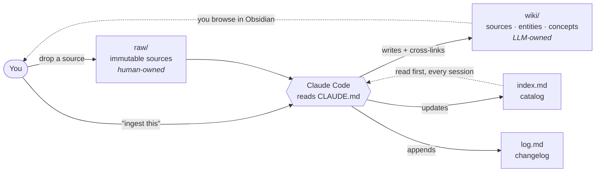

# Undercroft Lite

**A battle-tested schema for running an LLM-maintained personal wiki with Claude Code.**

You curate sources and ask questions. The model does all the reading, writing, cross-referencing, and bookkeeping. This repo is the free, open-source core of that pattern: a working vault contract, a starter skeleton, and the full ingest operation.

---

## The problem

Every personal knowledge base dies the same death. Capture is easy — clipping the article takes two seconds. *Maintenance* is unpaid labor: summarizing, linking, updating the index, noticing that this new source contradicts a note from March. That work always falls on future-you, and future-you never shows up. Six months in, you have a folder of unread clippings and a graph view of disconnected dots.

## The inversion

An LLM-maintained wiki flips the ownership. The human owns exactly one job: deciding what goes in. The LLM owns everything else — reading sources in full, writing summary pages, extracting every person, organization, and idea onto its own cross-linked page, flagging contradictions instead of overwriting, and keeping the index and changelog current *without being asked*.

The entire mechanism is one file: **`CLAUDE.md`**, a contract the model reads at the start of every session. It defines what the model owns, what it must never touch, and the exact checklist it runs every time you hand it a source. Claude Code picks this file up automatically — no plugins, no database, no app. Just markdown files in a git repo.

It sounds too simple to work. What makes it work is not the idea — it's the operational discipline written into the contract. That discipline is what this repo ships.

## Architecture

Three layers with strict ownership boundaries. Blurring them is how these systems rot.



| Layer | Path | Owner | Mutability |
|---|---|---|---|
| Raw sources | `raw/` | Human | Immutable — the model reads, never edits |
| Wiki | `wiki/` | LLM | The model writes and maintains everything here |
| Schema | `CLAUDE.md` | Co-evolved | Updated together when conventions change |

The catalog (`index.md`) and changelog (`log.md`) live at the vault root and are maintained by the model on every operation. The wiki — not the raw pile — is the interface: when you ask a question, the model answers from wiki pages and only falls back to `raw/` when the wiki comes up short.

## Quickstart (5 minutes)

Requirements: [Claude Code](https://claude.com/claude-code). [Obsidian](https://obsidian.md) is optional but recommended for browsing.

```bash
# 1. Get the skeleton
git clone https://github.com/latticeworklabs-eng/undercroft undercroft

# 2. Make it yours — a FRESH folder, so your vault gets its own git
#    history instead of inheriting this repo's
mkdir my-wiki
cp -r undercroft/starter/. my-wiki/
cp undercroft/CLAUDE.md my-wiki/
cd my-wiki
git init && git add -A && git commit -m "vault: init"

# 3. Add your first source — any article, paper, or essay you care about
#    e.g. save Paul Graham's "How to Do Great Work" as markdown into raw/

# 4. Start Claude Code and say:
claude
> ingest raw/how-to-do-great-work.md
```

The model will read the essay in full, surface key takeaways and ask what to emphasize, then create a source page, an entity page for the author, concept pages for the ideas worth keeping, and update `index.md` and `log.md` — all cross-linked with `[[wikilinks]]`. Open the folder as an Obsidian vault and watch the graph grow with every ingest.

A single ingest typically touches 5–15 pages. That fan-out is the point: it's what makes the graph compound instead of accumulate.

Want to see the result before you run it? [`example/`](example/) is this exact ingest — the Paul Graham essay — executed for real under this contract: the source page, three fan-out pages, and the index/log lines they produced. Compare your first run against it.

## What's in this repo

```
├── README.md          # you are here
├── CLAUDE.md          # the vault contract — the actual product
├── LICENSE            # MIT
├── example/           # one real ingest, file by file (PG's "How to Do Great Work")
│   ├── README.md      # reading order + what to notice
│   ├── wiki/          # the four pages the model wrote: source, entity, 2 concepts
│   ├── index-additions.md  # the exact index lines the ingest added
│   └── log-entry.md   # the exact log entry it appended
└── starter/           # copy its CONTENTS into a fresh folder to start a vault
    ├── index.md       # empty catalog, sections pre-laid
    ├── log.md         # empty changelog, format seeded
    ├── raw/README.md  # rules for the source layer
    └── wiki/README.md # rules for the wiki layer
```

## Honest scope

This free tier is the **schema skeleton plus the complete INGEST operation** — the single most important operation, fully specified: the seven-step checklist, frontmatter conventions, wikilink discipline, stub pages, contradiction handling, and index/log bookkeeping. It is genuinely complete on its own. Run only ingest for a year and you'll have a dense, cross-linked, queryable-by-any-LLM wiki. Nothing here is crippled, time-limited, or phoning home.

What it deliberately does **not** include is the rest of the operations discipline that emerged from long-term daily use:

- **QUERY** — how the model answers from the wiki (not the raw pile), chooses output formats, and files notable answers back in so they compound
- **LINT** — the periodic health check: orphans, dangling links, unflagged contradictions, stale claims, cross-reference gaps
- **Hot cache** — a hard-budgeted rolling working-memory file so any session (or external agent) knows what's active without crawling the vault
- Multi-session and git conventions, the schema-evolution protocol, ingests two and three of the worked example vault — cross-source appends, a flagged contradiction, a live schema change (`example/` here is ingest one) — and Claude Code skills (`/ingest`, `/query`, `/lint`)

## The full kit

**Start for $3:** [The Undercroft Operations Playbook](https://latticeworklabs.gumroad.com/l/undercroft-playbook) is the quickstart plus the complete operations manual from Core, standalone — the discipline before the contract, for the price of a coffee.

If the pattern clicks and you want the rest of the discipline, the paid kit — **[Undercroft Core](https://latticeworklabs.gumroad.com/l/undercroft-core)** ($29) and **[Undercroft Pro](https://latticeworklabs.gumroad.com/l/undercroft-pro)** ($79) — ships the complete contract with all operations, the full three-ingest example vault you can read page by page, and installable Claude Code skills. The free tier is the engine; the kit is the operating manual written from the scar tissue. No subscription, files you own forever.

**Launch discount:** the first 25 buyers get 50% off with code `LAUNCH50` — auto-applied at [Core for $14.50](https://latticeworklabs.gumroad.com/l/undercroft-core/LAUNCH50) or [Pro for $39.50](https://latticeworklabs.gumroad.com/l/undercroft-pro/LAUNCH50).

## Notes

- **Obsidian is optional.** The vault is plain markdown + `[[wikilinks]]`; any editor works. Obsidian adds graph view, backlinks, and link autocomplete.
- **Other coding agents:** the contract is plain instructions. Copy or symlink it to `AGENTS.md` (`ln -s CLAUDE.md AGENTS.md`) and most CLAUDE.md-style agents will follow it.
- **Support:** Lite is free and stays free. If it earned its keep, the [tip jar](https://latticeworklabs.gumroad.com/l/undercroft-support) ($0+, pay what you want) keeps it maintained — supporters get credited in [SUPPORTERS.md](SUPPORTERS.md).
- **Privacy:** a second brain accretes personal context fast. Keep the repo private; git history remembers everything.

## License

MIT — see [LICENSE](LICENSE).

---

<sub>Built and maintained by Latticework Labs.</sub>
